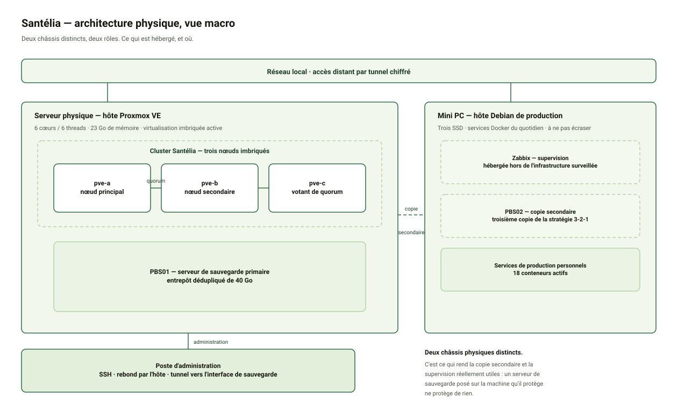
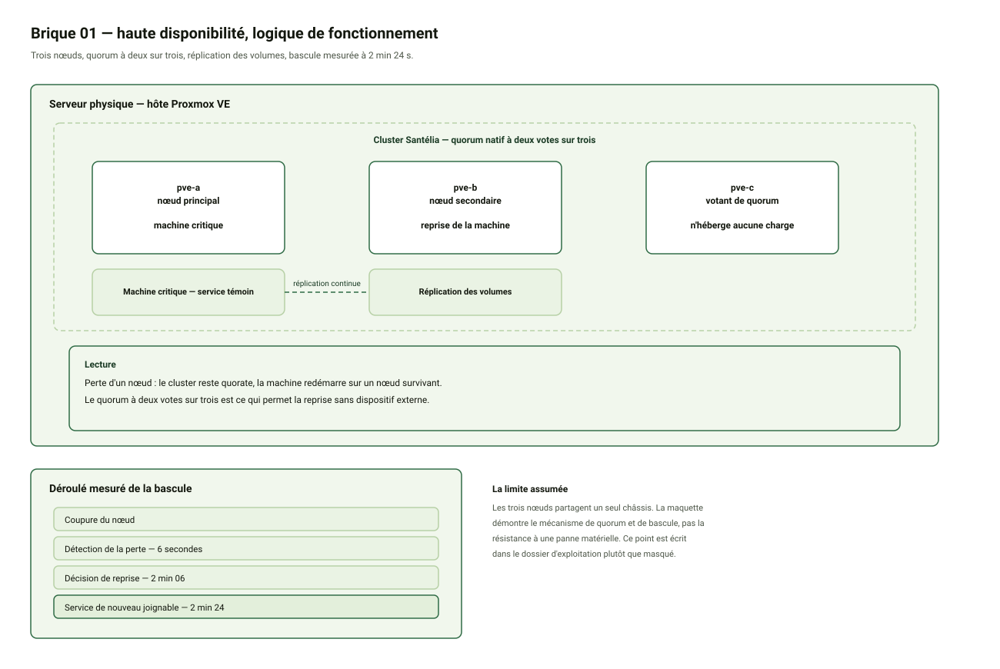

# Santélia — Configuration des 3 nœuds Proxmox

> Document diffusable
> Dépôt : `santelia-iac` — Dernière mise à jour : 05/10/2026

---

## 1. Objet du document

Ce document décrit la configuration retenue pour la brique **Proxmox VE HA** du projet Santélia, dont le rôle est d'héberger les VM critiques dans une architecture de haute disponibilité afin de limiter les interruptions de service.

**Statut :** cluster **créé et opérationnel** (quorate, trois nœuds, anneaux de communication vérifiés). La réplication et le groupe de haute disponibilité sont opérationnels.

Cette brique répond à l'exigence n° 1 du cahier des charges, classée **Must** : « Accès continu au DPI via haute disponibilité des VM ».

---

## 2. Écarts assumés

À déclarer explicitement dans la recette, puisqu'elle doit démontrer la conformité de façon objective.

| Écart | Justification | Impact |
| --- | --- | --- |
| Les 3 nœuds sont hébergés sur **une seule machine physique** | Contrainte matérielle du laboratoire | La maquette démontre le **mécanisme** de quorum, de réplication et de bascule, pas la résistance à une panne physique de l'hôte |
| **Pare-feu Proxmox désactivé** | Simplification de l'environnement de test | À activer en production |
| `host_key_checking = False` côté Ansible | Environnement de test | Écart de sécurité documenté, à corriger en production |
| **Aucun swap** dans les nœuds | Comportement Proxmox par défaut sur ZFS | Acceptable pour des nœuds de laboratoire, à surveiller |
| ZFS en **RAID0 (disque unique)** par nœud | Un seul disque virtuel par nœud | Aucune redondance au niveau du pool ; le pool sert à la réplication, pas à la tolérance de panne |
| **Un seul chemin de communication de cluster** | Configuration par défaut | Pas de redondance du lien de quorum si le réseau d'administration vacille |

---

## 3. Architecture

Un hyperviseur physique héberge **trois nœuds Proxmox VE imbriqués**, virtuellement séparés.

| Nœud | Rôle | vCPU | RAM | Disque |
| --- | --- | --- | --- | --- |
| `pve-a` | Nœud principal | 2 | 4 Gio | 24 Gio |
| `pve-b` | Nœud secondaire | 2 | 4 Gio | 24 Gio |
| `pve-c` | Votant de quorum | 2 | 4 Gio | 24 Gio |

### Pourquoi trois nœuds et pas deux

Le quorum Corosync exige une **majorité stricte**. À trois nœuds, la majorité est de deux : perdre un nœud laisse le cluster opérationnel. À deux nœuds, il faudrait ajouter un **QDevice** externe pour obtenir cette même majorité.

Le choix de trois nœuds supprime donc le besoin d'un QDevice, d'un export NFS comme stockage partagé, et de toute la complexité qui va avec.

### Pourquoi les trois nœuds sur la même machine

Les trois nœuds partagent un processeur identique, ce qui autorise l'exposition du **type CPU natif** et supprime toute contrainte de compatibilité pour la migration à chaud. Un nœud placé sur une seconde machine physique, de génération différente, aurait imposé un modèle de CPU conservateur au détriment des performances.

---

## 4. Prérequis techniques

### Activation de la virtualisation imbriquée

L'hôte doit exposer les instructions de virtualisation matérielle à ses invités, sinon un nœud démarre mais **refuse de lancer ses propres machines virtuelles**.

Vérification : le paramètre `nested` du module KVM doit valoir `Y`.

### Paramétrage des VM

| Paramètre | Valeur | Justification |
| --- | --- | --- |
| Type de CPU | **Natif** | Sans lui, le nœud démarre mais ne peut pas virtualiser |
| Gestion mémoire dynamique | **Désactivée** | Comportement erratique dans un hyperviseur déjà virtualisé |
| Discard | **Activé** | Permet au stockage thin de récupérer les blocs libérés |
| Démarrage automatique | **Activé** | Les nœuds reviennent après un redémarrage de l'hôte |
| Deux cartes réseau | — | Une pour l'administration, une pour le réseau de service |

### Plafonnement du cache ZFS

ZFS consomme par défaut jusqu'à la moitié de la RAM disponible en cache. Sur trois nœuds de 4 Gio, cela provoque une saturation mémoire. Le cache est donc plafonné à **512 Mio par nœud**.

---

## 5. Stockage

### Hôte physique

| Volume | Taille | Rôle |
| --- | --- | --- |
| Système | 69 Gio | Système d'exploitation, modèles de conteneurs, images ISO |
| Thin pool | 141 Gio | **Disques des machines virtuelles** |
| Sauvegardes | 60 Gio libres | Sauvegardes `vzdump` |
| Disque annexe | 245 Gio | ⛔ Réservé à un autre projet, hors périmètre |

Les disques des nœuds sont créés dans le **thin pool**, ce qui permet de sur-allouer : un disque de 24 Gio annoncé n'occupe que l'espace réellement écrit.

### Nœuds

Chaque nœud est installé en **ZFS sur disque unique**.

Ce choix n'est pas guidé par la redondance, mais par le **nom du pool**. Proxmox nomme systématiquement son pool système de la même façon, ce qui rend la **réplication native entre nœuds** possible. C'est ce mécanisme qui permettra à une VM de redémarrer sur un nœud survivant.

Capacité utile constatée : environ **20,8 Gio** sur les 24 Gio alloués, ZFS réservant près de 13 % pour ses métadonnées.

---

## 6. Réseau

| Interface | Rôle |
| --- | --- |
| **Administration** | Accès web et SSH aux nœuds, trafic de cluster Corosync |
| **Service** | Segment L2 commun aux instances du service applicatif |

La séparation en deux plans répond à deux besoins distincts. Le réseau d'administration supporte l'exploitation et le clustering, le réseau de service supporte la continuité applicative.

### Point d'attention : L2 obligatoire pour Corosync

Corosync échange ses votes en multicast sur le même segment de niveau 2. Il ne doit **jamais** traverser un NAT, sous peine de votes fantômes et de pertes de quorum inexpliquées.

### Accès distant

Les nœuds imbriqués ne sont pas des machines indépendantes sur le réseau. L'administration à distance s'effectue par **rebond SSH** via l'hôte physique, ce qui fonctionne aussi bien sur le réseau local qu'à distance.

### Adressage

Six adresses statiques sont nécessaires : trois pour les nœuds, trois réservées à l'avance pour les futurs services. Elles doivent être **exclues de la plage DHCP** du réseau pour éviter tout conflit.

---

## 7. Procédure de duplication d'un nœud

Le clonage d'une machine virtuelle duplique son identité. Trois éléments doivent impérativement être régénérés dans chaque clone, **avant tout test de connexion**.

| Élément | Risque si dupliqué |
| --- | --- |
| **Clés d'hôte SSH** | Rejet des connexions, alertes de sécurité, échec du clustering |
| **Identifiant machine** | Comportements erratiques des services, traces ambiguës |
| **Adresse réseau** | Conflit d'adresses, coupures intermittentes |

### Procédure

1. Renommer la machine.
2. **Supprimer** les clés d'hôte existantes.
3. Les régénérer.
4. Régénérer l'identifiant machine.
5. Modifier l'adresse réseau et le fichier de résolution local.
6. Redémarrer le service SSH.
7. Redémarrer la machine.

### Piège documenté

**L'outil de génération de clés SSH ne régénère jamais une clé existante.** Il crée uniquement les clés manquantes, et il reste totalement silencieux lorsqu'il n'a rien à faire.

Conséquence : si l'étape de suppression n'est pas exécutée, la commande ne produit rien et le clone conserve l'identité de la machine d'origine. C'est l'erreur la plus coûteuse de cette phase.

### Bonne nouvelle sur l'identifiant machine

Sur une machine virtuelle, l'identifiant machine n'est pas tiré au hasard : il est **dérivé de l'identifiant unique exposé par l'hyperviseur**. Comme l'opération de clonage régénère cet identifiant, chaque clone dispose déjà du sien dès son premier démarrage. La régénération est donc une **ceinture de sécurité**, pas une urgence.

### Symptômes d'une identité dupliquée

- Le client SSH signale que la clé du serveur est connue sous un **autre nom ou une autre adresse**.
- Une connexion SSH s'établit puis est coupée brutalement avant toute authentification.
- Le service SSH apparaît actif alors qu'il ne peut servir aucune connexion.

### Vérification

Les empreintes de clés d'hôte de tous les nœuds doivent être **différentes**. Le commentaire associé à chaque clé indique le nom de la machine qui l'a générée, ce qui permet d'identifier immédiatement un partage d'identité.

---

## 8. Vérifications réalisées

| Contrôle | Méthode | Résultat obtenu |
| --- | --- | --- |
| Virtualisation imbriquée | Recherche du flag `vmx` dans le processeur | Présent, non nul sur les trois nœuds |
| Pool ZFS | État et nom du pool système | `rpool` en ligne, **nom identique** sur les trois nœuds |
| Espace disponible | Espace libre de chaque pool | ~21,5 Gio libres par nœud |
| Cache ZFS | Valeur du plafond en mémoire | 512 Mio appliqués |
| Unicité des noms | Nom d'hôte de chaque nœud | Trois valeurs distinctes |
| Unicité des identités | Identifiants machine et empreintes SSH | Trois valeurs distinctes |
| Unicité réseau | Comparaison des adresses MAC déclarées et observées | Trois adresses distinctes, sans conflit |
| Accès automatisé | Connexion SSH **sans mot de passe** | Réussie sur les trois nœuds |

> Une adresse MAC identique observée sur deux nœuds peut provenir d'un **cache réseau obsolète**. Vider la table et réinterroger avant de conclure à un conflit réel.
>
> Un pont réseau hérite de l'adresse MAC de son premier port : c'est un comportement normal, pas un conflit.

---

## 9. Création du cluster

Le cluster a été créé et assemblé le **05/10/2026**. Il est **quorate** avec trois nœuds participants.

| Caractéristique | Valeur |
| --- | --- |
| Nom du cluster | `santelia` |
| Transport | `knet` |
| Authentification sécurisée | Activée |
| Nœuds | **3** |
| Votes attendus | **3** |
| **Majorité requise (quorum)** | **2** |
| État | `Quorate` |

### Déroulé de l'assemblage

| Étape | Date | Version de configuration |
| --- | --- | --- |
| Création sur le nœud principal | 05/10 à **09:18** | 1 |
| Jonction du 2e nœud | 05/10 à **09:27** | 2 |
| Jonction du 3e nœud | 05/10 à **09:30** | 3 |

### Bénéfice du quorum à deux sur trois

La perte d'un nœud laisse le cluster **opérationnel**. C'est précisément ce qu'apporte la solution à **trois nœuds** : une majorité atteignable sans dispositif externe. Une solution à deux nœuds aurait nécessité un **QDevice** supplémentaire pour obtenir la même résilience.

### Piège rencontré, à documenter

La jonction d'un nœud échoue si le **fichier de résolution local** contient encore les informations de la machine d'origine. Deux problèmes constatés après clonage :

1. **L'adresse héritée** pointait vers le nœud source. Le cluster ne pouvait alors pas déterminer l'adresse locale de la machine, et refusait la jonction avec un message explicite.
2. **Le nom pleinement qualifié** contenait un caractère erroné, rendant la résolution incohérente avec le nom court de la machine.

Correction : la ligne de résolution locale doit associer **la bonne adresse** au **nom complet correct**, suivi du **nom court**. Le contrôle consiste à comparer nom court, nom complet et résolution par nom court : les trois doivent concorder.

> Cette correction est le **quatrième effet du clonage**, après les clés d'hôte SSH, l'identifiant machine et l'adressage réseau. Elle justifie à elle seule l'automatisation de la procédure en phase de standardisation.

---

## 10. Contrôles post-création effectués

| Contrôle | Résultat obtenu |
| --- | --- |
| État du cluster | Trois nœuds, trois votes, quorum à deux, indicateur « quorate » |
| Liste des membres | Les trois nœuds présents, **un vote chacun** |
| **Anneaux de communication Corosync** | **Tous les liens « connected », aucun paquet perdu** |
| Cohérence des pools de réplication | Nom de pool identique sur les trois nœuds |
| Unicité des identifiants machine | Trois valeurs distinctes |

> Le contrôle des **anneaux de communication Corosync** est le plus souvent négligé. Il révèle les clusters qui fonctionnent en apparence mais perdent leur quorum sans explication au bout de quelques semaines. Il est recommandé de le systématiser après toute opération sur le cluster.

---

## 11. État d'avancement

| Élément | État |
| --- | --- |
| Hôte physique | Opérationnel, virtualisation imbriquée active |
| Trois nœuds Proxmox | Installés, identités uniques, administrables à distance |
| **Cluster** | ✅ **Créé le 05/10/2026**, quorate à 3 nœuds, majorité à 2 |
| Anneaux de communication | ✅ Tous les liens actifs |
| Réplication entre nœuds | ✅ Opérationnelle, état `OK` |
| Groupe de haute disponibilité | ✅ Configuré, ressource critique rattachée |

### Étapes suivantes

1. ✅ **Création du cluster** et jonction des trois nœuds — **fait le 05/10/2026**.
2. ✅ **Contrôle du quorum et des anneaux** : trois votes, majorité à deux, état « quorate », liens actifs.
3. ✅ **Réplication** des volumes entre nœuds.
4. ✅ **Groupe HA** et machine virtuelle de test.
5. ✅ **Démonstration de bascule** horodatée — voir le document « Test de recette HA ».

---

## 12. Cibles de recette associées

### Test de recette défini par le cahier des charges

| Brique | Test | Résultat attendu | Preuve exigée |
| --- | --- | --- | --- |
| **HA / Proxmox VE** | Simuler l'indisponibilité d'un nœud hébergeant une VM critique | Le service reste disponible ou est rétabli dans le délai cible | **Compte rendu + horodatage** |
| **Sauvegarde / PBS** | Lancer une sauvegarde puis tester une restauration | Sauvegarde exploitable et restauration réussie | **Journal de sauvegarde + preuve de restauration** |
| **Supervision / Zabbix** | Vérifier la remontée et déclencher une alerte | Les 30 postes visibles, alerte remontée correctement | **Capture/export Zabbix + journal** |
| **IaC / Ansible** | Déployer ou reconfigurer une machine de test, puis rejouer le playbook | Configuration identique et standardisée, sans action manuelle | **Playbook + sortie d'exécution + état final** |

> La recette vérifie chaque brique **séparément puis leur fonctionnement conjoint**, et les tests sont réalisés sur l'**environnement de validation avant la mise en production**.

### Indicateurs complémentaires proposés

Ces indicateurs sont **proposés** et restent à valider.

| Domaine | Indicateur | Cible proposée |
| --- | --- | --- |
| Sauvegarde | RPO (perte de données maximale) | < 15 min |
| Sauvegarde | Temps de restauration d'une VM critique | < 30 min |
| Ansible | Temps de déploiement ou de reconfiguration | < 15 min |
| Zabbix | Réactivité des alertes vers la DSI | < 2 min |

---

## 13. Rappel des exigences et priorités

| # | Exigence | Priorité | Brique retenue |
| --- | --- | --- | --- |
| 1 | Accès continu au DPI via haute disponibilité des VM | **Must** | Proxmox VE HA |
| 2 | Sauvegarde 3-2-1 et restauration | **Must** | PBS + copie secondaire |
| 3 | Automatisation des serveurs et applications | **Must** | Ansible + playbooks |
| 4 | Supervision centralisée des 30 postes | Should | Zabbix |

> Les exigences **Must** sont traitées en priorité, en vérifiant que les options retenues restent compatibles avec l'enveloppe maximale de 15 000 €.

---

_Les identifiants techniques détaillés (adressage complet, empreintes, identifiants machine) sont conservés dans une annexe interne non jointe à ce document._

_Source : cahier des charges Santélia, Bloc 2 AIS — Groupe 2._
